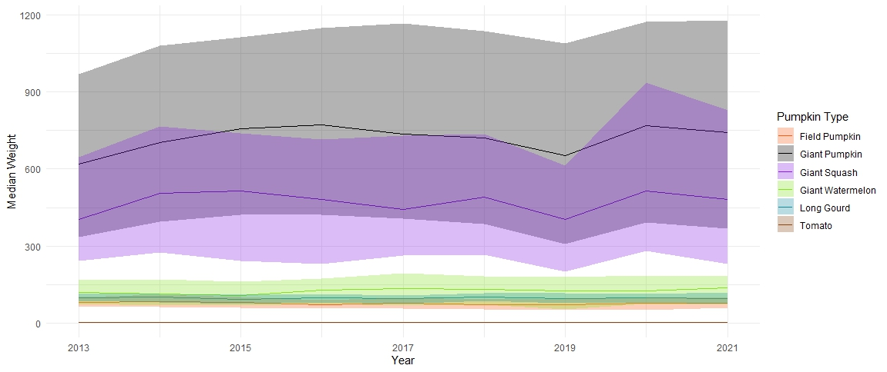

# Tidy Tuesday 19/10/2021- Giant Pumpkins
| Official Tidy Tuesday Repo for this activity: https://github.com/rfordatascience/tidytuesday/blob/master/data/2021/2021-10-19/readme.md

See below the outputs we made in our meeting on 23rd 10th 2024. 

Code and data can be found in this folder.

_Ribbon Plot of Median Pumpkin Weight Over the Years with Shading for Range_

_Line Plot of Max Pumpkin Weight Over the Years_

